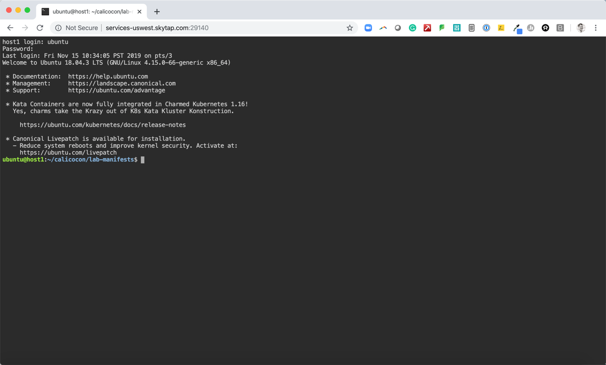
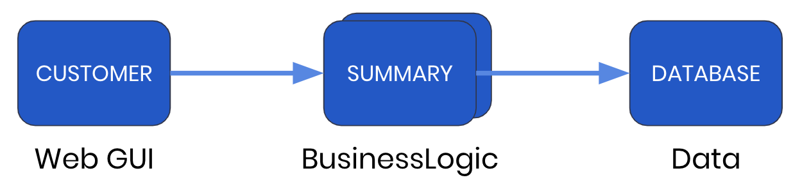

# Getting Started with Your CalicoCon Lab

You should have received an email with instructions on how to connect to your lab. If you cannot find the email, you can request your lab details by sending the following message to the CalicoCon 2019 channel https://calicousers.slack.com/archives/CQD6DSX7B: "Please send me the lab login for <your_email_address>"

The lab environment consists of 4 servers
1. Kubernetes Master
2. Worker Node 1
3. Worker Node 2
4. Standalone Host

In this lab you will:
* Access the lab and web-based terminal
* Install Calico
* Launch the sample application
* Access the sample application frontend GUI


## A. Access the Lab and Web-Based Terminal

Access your lab servers using the "Host Terminal" URL sent with your lab login details. The URL provides remote access to the standalone host's terminal (`host1`) via HTML5, and serves as a jump server to access each of the Kubernetes nodes. Login using the credentials we supplied you today.



## B. Initialize the Terminal

In the standalone hosts terminal, start a tmux session using the following command:
```
tmux new -t calico
```

This will allow CalicoCon support staff to help you remotely if you have problems any of the labs.

## C. Download the Lab Notebooks and Manifests

```
git pull
```

## D. Install Calico
Calico will be the networking (CNI) and network policy implementation used in this lab. 
Open the web-based terminal window described above in section A. You can copy/paste commands from this notebook to the terminal using CMD-C and CMD-V (in the terminal window). (For Windows users the standard CTRL-C and CTRL-V are used for copy/paste.)

To install Calico run the following command in the terminal window.

```
kubectl apply -f 010-calico.yaml
```

## E. Launch Sample Application
For this lab, we will use a fake application called "Yet Another Online Bank" (yaobank). The applications consists of 3 microservices.
1. Customer (which provides a simple web GUI)
2. Summary (some middleware business logic)
3. Database (the persistent datastore for the bank)



### 1. Launch the application using the following commands

```
kubectl apply -f 110-yaobank.yaml
```

### 2. Check the status of the pods, wait until all are RUNNING status.
```
kubectl get pods -n yaobank
```
```
ubuntu@host1:~/calicocon-master/lab-manifests$ kubectl get pods -n yaobank
NAME                        READY   STATUS              RESTARTS   AGE
customer-5df6b999fb-qmbjz   1/1     Running             0          87s
database-7d4b6bf788-mgl2n   1/1     Running             0          87s
summary-6c755fccd5-mb54l    1/1     Running             0          87s
summary-6c755fccd5-s6b7w    1/1     Running             0          87s
```

### 3. You can also verify successful deployment with the `rollout status` command

```
kubectl rollout status -n yaobank deployment/customer
kubectl rollout status -n yaobank deployment/summary
kubectl rollout status -n yaobank deployment/database
```


## F. Access the Sample Application Web GUI
Browse to the "Web Application" URL sent with your lab login details. You should see the bank balance for a user account.

Congratulations! You are all set up ready for the rest of the day.

